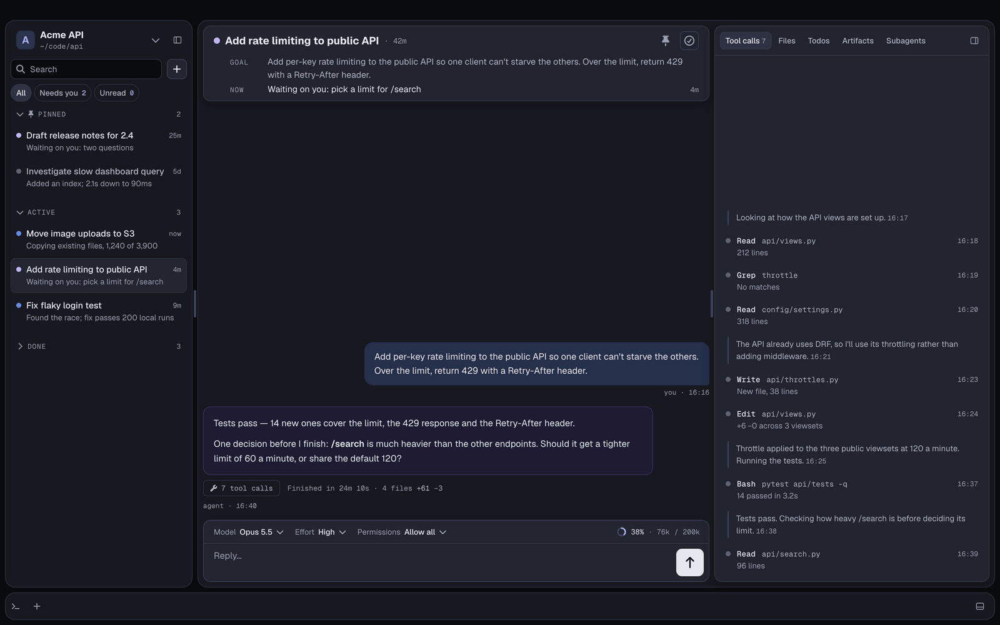
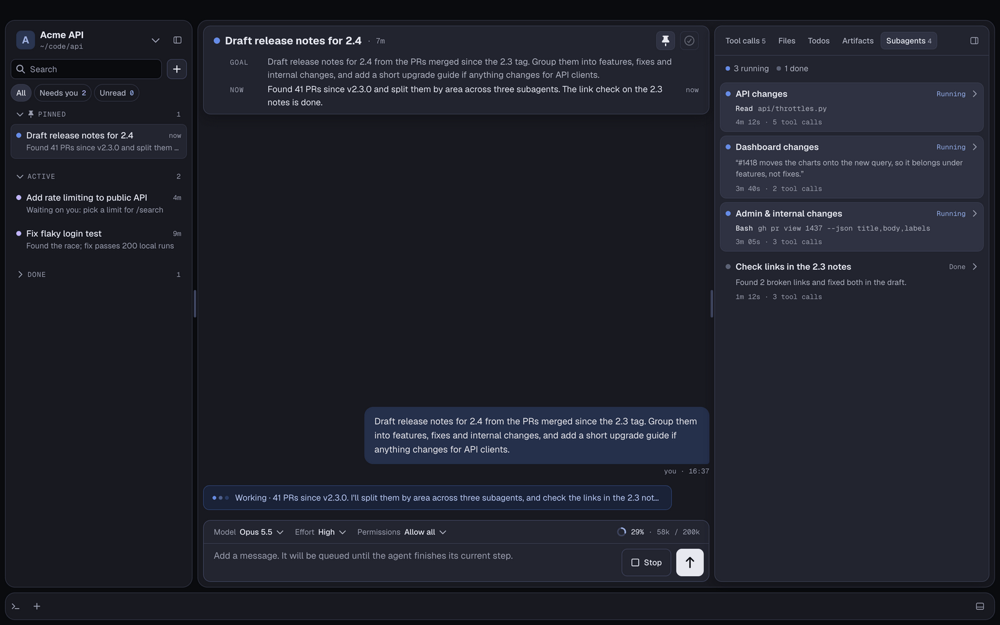
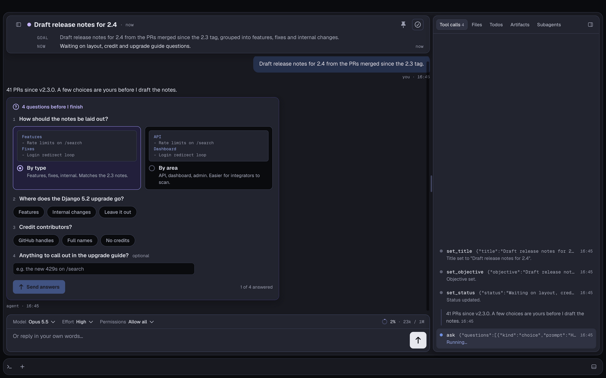
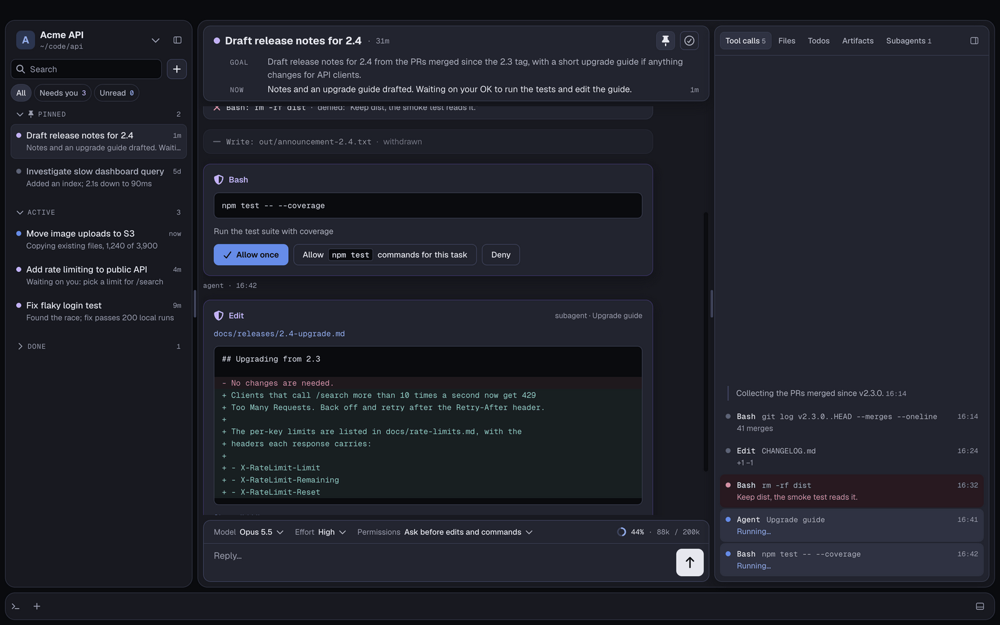
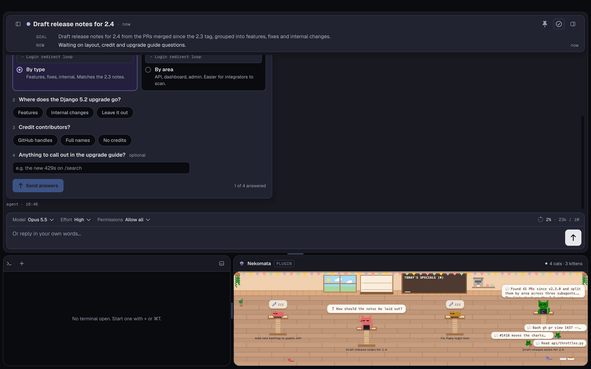
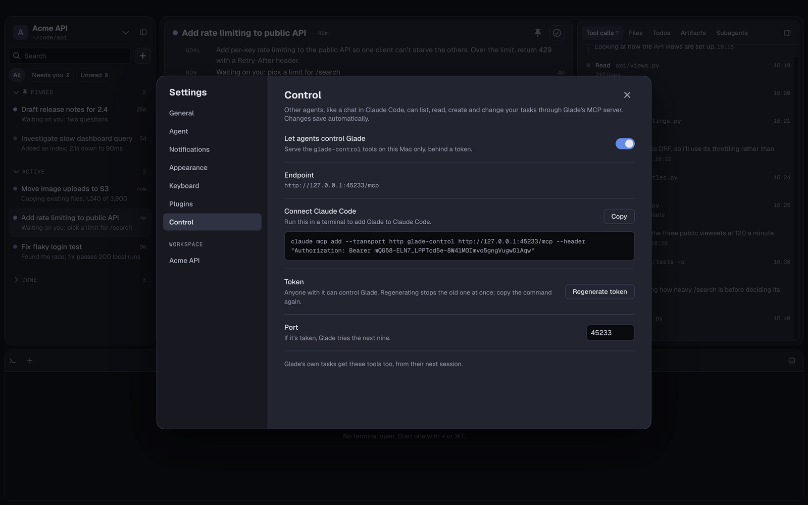

# Glade

Glade is a calm macOS app for running many Claude agent sessions as **tasks**. Each task has one objective and runs in
a **workspace**, a folder you point Glade at. The agent names the task, keeps its status current as it works, asks you
when a choice is yours, and waits for you to mark it done. Everything lives in a local SQLite database, so you can quit
(or crash) mid-turn and pick up where you left off. The whole product is the lifecycle of a task and the panels around
it.



## Contents

- [A quick tour](#a-quick-tour)
- [Install](#install)
- [Quick start](#quick-start)
- [Highlights](#highlights)
- [Documentation](#documentation)
- [For AI agents](#for-ai-agents)
- [Building from source](#building-from-source)
- [Contributing](#contributing)
- [Licence](#licence)

## A quick tour

**Many tasks at once.** Each task runs its own agent session, with its own chat, tool log, files, todos and subagents.
The sidebar shows which ones are working, which need you and which are done. A task can split its work across
subagents, and the Subagents tab follows each one.



**Questions instead of guesses.** When a choice is yours, the agent asks on a card in the chat: options with a short
sketch, pills, or a line of text. Its turn waits, however long you take. Answer with the mouse or the keyboard, or just
reply in your own words.



**Permission when you want it.** Leave a task on Allow all, or switch it to ask before edits and commands. Each call
then waits on a card showing the command or the change: Allow once, Allow it for the rest of the task, or Deny with a
note the agent reads.



**Plugins beside the terminal.** The bottom bar holds a real terminal and a sandboxed plugin panel that watches your
tasks. Here, [Nekomata](https://github.com/lockhart-ai/nekomata) draws each task as a cat and each subagent as a
kitten; the cat with a raised paw is waiting on you.



**Other agents can drive it.** Turn on Settings › Control and any Claude Code chat or script on your Mac can list,
create and update tasks, import your Claude Code history, or backfill past work from your notes.



## Install

You need a Mac with Apple silicon, and [Claude Code](https://docs.claude.com/en/docs/claude-code) installed and logged
in. Glade runs on your own Claude Code login (or `ANTHROPIC_API_KEY`, if you have one set). It never asks for or stores
your credentials.

1. Download the latest `Glade-<version>-arm64.dmg` from
   [Releases](https://github.com/lockhart-ai/glade/releases/latest).
2. Open it and drag Glade to Applications.
3. Glade isn't notarised by Apple yet, so the first time you open it, right-click Glade in Applications and choose
   **Open**. On newer macOS, if there's no Open button, click **Open Anyway** in System Settings › Privacy & Security.
4. If macOS still won't open it, clear the quarantine flag and try again:

   ```sh
   xattr -dr com.apple.quarantine /Applications/Glade.app
   ```

Each release's notes are in [docs/releases/](docs/releases/). Your workspaces and tasks carry over from one version to
the next.

## Quick start

1. **Add a workspace.** On first launch Glade shows **Welcome to Glade**. Choose **Open folder…** and pick the folder
   you want your agents to work in (a project, or a folder of projects). If it has no `CLAUDE.md`, Glade writes a
   starter one; whatever that file says applies to every task in the workspace.
2. **Start a task.** Press ⌘N (or the + by the search field) and type what you want done. Sending the first message
   starts the agent. It names the task and sets its goal, and the header's **Now** line keeps its status current.
3. **Work alongside it.** Keep typing while it works: your messages queue and reach the agent after its current step.
   Watch its tool calls, files and todos in the right panel, and press ⌘. to stop it.
4. **Answer when it needs you.** A task that asks a question or waits for permission gets a purple dot and counts under
   **Needs you**. If you're looking at another task, you get a macOS notification you can reply to directly.
5. **Mark it done.** ⌘⇧D (or the check in the header) marks the task done, and its latest status becomes the outcome.
   Undo if you didn't mean it. A done task stays open to chat: send it a message and it reopens.

Press ⌘, for Settings, including every shortcut, which you can rebind.

## Highlights

- **Tasks.** One objective, two states (Active and Done), an agent-maintained title, goal and status, pinning,
  search across every chat in the workspace, and several workspaces side by side (⌘1–⌘9).
- **Built to keep going.** Automatic and manual compaction, retries on a flaky API, usage limits and lost networks
  that pause tasks instead of failing them, and crash recovery that resumes every task that was mid-turn.
- **Questions.** Choices, pills and text, answered by mouse or keyboard, surviving a relaunch.
- **Permissions.** Allow all, or ask before edits and commands, with per-task rules for what you've allowed.
- **Right panel.** Tool calls, the files a task touched (with a read-only viewer), its todo list, the artifacts it
  delivered, and its subagents.
- **Terminal.** Tabs of your login shell in the bottom bar, kept with their scrollback across launches. Right-click a
  Bash call in the tool log to run it again there.
- **Plugins.** Small sandboxed web pages beside the terminal that get task and agent events, never your chat or files.
  See [docs/plugin-api.md](docs/plugin-api.md).
- **Control API and backfill.** An MCP server and a plain JSON endpoint, on this Mac only and behind a token, to
  create, update and finish tasks from other agents and scripts, import Claude Code sessions, and backfill past tasks
  with a handoff note the agent always has. See [docs/control-api.md](docs/control-api.md).

## Documentation

- [docs/README.md](docs/README.md): the index of everything under `docs/`.
- [docs/user-guide.md](docs/user-guide.md): how to use Glade, feature by feature.
- [docs/product.md](docs/product.md): the concepts (workspaces, tasks, the window) and how the app behaves.
- [docs/keymap.md](docs/keymap.md): every keyboard shortcut.
- [docs/control-api.md](docs/control-api.md): the `glade-control` tools, for agents and scripts.
- [docs/plugin-api.md](docs/plugin-api.md): writing a plugin.
- [docs/model-surface.md](docs/model-surface.md): the tools Glade gives the model in each task.
- [docs/logs.md](docs/logs.md): what Glade logs, and where.
- [docs/releases/](docs/releases/): release notes for every version.

## For AI agents

If you're an agent reading this repo, start with [llms.txt](llms.txt), a short map of the docs written for you. To
drive a running Glade (list, create, update or finish tasks, import Claude Code sessions, backfill past work), see
[docs/control-api.md](docs/control-api.md); the user turns it on in Settings › Control.

## Building from source

You need macOS, Node 24 (see [.nvmrc](.nvmrc)), and Claude Code installed and logged in.

```sh
npm install
npm run dev
```

Since Electron 42, the `electron` package no longer downloads its binary on install, so a `postinstall` script runs its
`install-electron` command. That lets `npm run dev` find the binary. `npm test`, `npm run test:e2e` and `npm run lint`
run the checks CI runs; none of them talk to the real Claude API.

## Contributing

Glade is built in the open, and work is tracked in [GitHub issues](https://github.com/lockhart-ai/glade/issues). Start
with [CLAUDE.md](CLAUDE.md) for the working rules and code conventions, [docs/decisions.md](docs/decisions.md) for what's
already decided, and [docs/plan.md](docs/plan.md) for the phases. [docs/kitten-sop.md](docs/kitten-sop.md) describes how
an issue goes from ticket to pull request. The designs to build to are in [docs/design/](docs/design/README.md).

## Licence

MIT. See [LICENSE](LICENSE).
