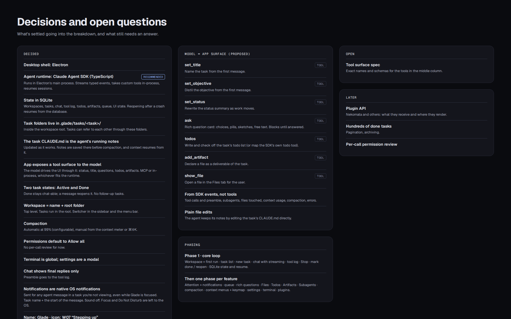

# Decisions

## Decided

- **Desktop shell:** Electron. macOS first.
- **Agent runtime:** Claude Agent SDK (TypeScript), running in Electron's main process. It streams typed events, takes
  custom tools in-process, resumes sessions and reads CLAUDE.md files. (Recommended over driving the Claude Code CLI.)
- **Auth:** login-based. Glade runs on the user's own Claude Code login. Glade never handles credentials itself: no
  claude.ai login screen, no reading or storing OAuth tokens. It runs the SDK's unmodified bundled Claude Code binary,
  which still uses `ANTHROPIC_API_KEY` if one happens to be set. Policy risk: Anthropic's docs don't clearly permit
  subscription use by a third-party app (see `sdk-notes.md` §1 and Open risks).
- **State:** everything in SQLite — workspaces, tasks, chat, tool log, todos, artifacts, queue, UI state. Reopening
  after a crash resumes from the database.
- **Agent sessions run in the workspace root** (the SDK session's `cwd`), so the workspace's own `CLAUDE.md` (the
  user's conventions and personal context) loads for every task.
- **Task metadata lives only in SQLite.** Glade keeps nothing of its own on disk in the workspace.
- **On-disk layout is convention, not app logic.** Where a task keeps its files (e.g. a folder per task, worktrees
  inside it) is described in the workspace `CLAUDE.md`. When Glade creates a workspace whose root has no `CLAUDE.md`,
  it writes a starter one describing a task-folder convention; it never modifies an existing one. The system prompt
  gives the agent its task's id and title so conventions can use them.
- **Compaction** relies on the SDK's own summary. Any note-keeping before compaction is up to the workspace
  conventions, not Glade.
- **Deleting a task** removes its database rows only; it never touches files on disk.
- **Model ↔ app surface:** the app exposes tools the model uses to drive the UI (see `model-surface.md`). The agent
  sets the title and objective from your first message and keeps the status current.
- **Two task states:** Active and Done. Done stays chat-able; a message reopens it. No follow-up tasks.
- **Workspace** = name + root folder, top level. Switcher in the sidebar and the macOS menu bar.
- **Chat shows final replies only.** Preamble goes to the tool log.
- **Compaction:** automatic at the SDK's default auto-compact threshold; manual from the context meter or ⌘⇧K.
- **Permissions:** default Allow all. Each task can switch to "Ask before edits and commands" instead (P11, see
  below).
- **Message queue:** messages sent while the agent works are queued and delivered after its current step. They can be
  edited or removed. No "send now", no reordering.
- **Notifications:** native OS notifications for any agent message in a task you're not viewing, even while Glade is
  focused. Task name + start of the message. Sound off. Focus/DND handled by the OS.
- **Terminal** is global (not per task). **Settings** are a modal.
- **Name:** Glade. **Icon:** "Stepping up" — three grass blades rising into the wind, the middle one lit
  (`assets/icon/`).

- **Stack:** well-established, widely adopted tools only. electron-vite (build/dev), React + TypeScript (strict), CSS
  Modules with the design tokens as CSS variables, Zustand (renderer store), better-sqlite3 (main process), Vitest +
  React Testing Library (unit/integration, 100% line coverage), ESLint (typescript-eslint) + Prettier, electron-builder
  (packaging), xterm.js + node-pty (terminal).
- **Terminal internals:** main owns the shells, one node-pty pseudo-terminal per tab, each your login shell (`$SHELL
  -l`) started in the root of the workspace you're looking at. The renderer draws them with xterm.js (`@xterm/xterm`
  and its fit addon) and reaches them only through typed, zod-validated bridge commands (attach, type, resize, clear,
  interrupt, close): it can't name a program or a folder to run, only type into a shell you opened. node-pty is a
  Node-API addon with prebuilt macOS binaries, so it loads under Node and Electron alike and needs no rebuild
  (`npmRebuild: false`, as for better-sqlite3); `scripts/fix-node-pty.mjs` makes its prebuilt spawn-helper executable
  after install (1.1.0 ships it without the bit), and electron-builder unpacks it from the asar archive. Unit tests run
  on a fake pseudo-terminal; only the app and the e2e specs start real shells (e2e mode runs a plain bash). Tabs,
  names, folders and each tab's last 100,000 characters of output live in SQLite; a relaunch shows that output above a
  new shell under a dim "restored" divider, since processes don't survive a restart.
- **Icons:** Font Awesome (free regular + solid SVG icons via the official React packages), bundled locally; regular
  style preferred to match the designs' thin strokes.
- **Overlays:** Floating UI (`@floating-ui/react`) positions menus and popovers and handles their focus, dismissal and
  list keyboard navigation; overlays render in a portal.
- **Validation:** zod at every boundary (IPC requests, SDK events, tool inputs, JSON from disk); schemas are checked
  against the named interfaces.
- **Releases:** one minor release per phase (P1 is 0.1.0), built and published by `.github/workflows/release.yml` from
  a pushed tag (`releasing.md`). Apple silicon only. Builds are **ad-hoc signed** (no certificate, not notarised) so a
  download opens with right-click → Open instead of being reported as damaged. Developer ID signing and notarisation
  come later (L-04, #69).

- **Per-call permission review (P11, #68).**
  - The input bar's permissions picker has two modes: **Allow all** (the default) and **Ask before edits and
    commands**. The mode is saved per task, like model and effort. Settings › Agent › Permissions sets the default
    for new tasks: its "Ask first" option becomes this mode and "Allow edits" stays disabled.
  - In the ask mode, tools with side effects ask first: `Bash`, `Edit`, `Write`, `MultiEdit`, `NotebookEdit`,
    and any tool Glade doesn't know to be read-only, including other MCP servers'
    tools. Reads and searches (`Read`, `Glob`, `Grep`, `WebFetch`, `WebSearch`, …), Claude Code's todo and subagent
    tools, and Glade's own MCP tools (`mcp__glade__*`) never ask. The user's own settings still apply: their allow
    and deny rules decide without asking, and a user `ask` rule shows the card even for a read.
  - A request shows as a **permission card** in the chat, styled like the `ask` question card: the tool, its input
    (the command, or the file and the change), and, for a subagent's call, which subagent. It offers **Allow once**,
    **Allow for this task** (that tool, or for `Bash` that command prefix) and **Deny**, with an optional note that
    goes back to the agent. When the SDK says a request mustn't be remembered (`suppressAlwaysAllowRule`), Allow for
    this task isn't offered; when it says it mustn't be approved by a stray key (`defaultToNo`), Deny has the focus.
  - While a card waits, the task needs you, exactly as with an open question: purple dot, Needs you, unread and a
    native notification when you aren't viewing it. A message sent meanwhile is queued as usual; Stop withdraws the
    request.
  - The rules granted by Allow for this task are stored per task in SQLite and apply for the rest of the task,
    across relaunches. Pending requests are stored too: after a relaunch the card is still there and the task still
    needs you. The call itself can't survive (its Claude Code process is gone), so answering then resumes the session
    and tells the agent the decision in a message, as a question answered after a restart does. See
    `sdk-notes.md` §9.
- **Plugins (P12, #66).**
  - A plugin is a folder `~/Library/Application Support/glade/plugins/<id>/` (Glade's `userData`) holding a
    `manifest.json`: `id` (the folder's name), `name`, `version`, `entry` (an HTML file in the folder) and an optional
    `icon`. The manifest is validated with zod; a plugin whose manifest is invalid is listed with the reason and
    doesn't load. Installing is copying a folder there; there's no store or installer.
  - A plugin renders in the bottom bar's right side, beside the terminal (the Nekomata card in `task-workspace.png`),
    in a sandboxed view of its own: a separate process (a `WebContentsView` with its own session), no Node, a preload
    that only relays messages, a CSP that blocks all network except localhost, no navigation and no new windows.
  - Glade sends it typed task and agent events with `postMessage`, in a versioned schema (`plugin-api.md`). The plugin
    sends back only `ready` and a short header status. It can't command Glade.
  - Settings › Plugins lists the installed plugins, each with an enable/disable toggle, and has **Open plugins
    folder**. Whether each plugin is enabled lives in SQLite.
  - The bottom bar splits into terminal | plugin with a drag handle; the plugin's width is saved in SQLite. With no
    enabled plugin, the terminal takes the whole bar.
  - Nekomata gets a Glade build that consumes these events instead of reading transcripts (work in the nekomata
    repo, tracked in this one).
  - These parts have no design screens. They're built from the existing tokens and components, and their PRs include
    screenshots for review.

## Open

- Exact names and schemas for the model surface tools (a draft is in `model-surface.md`).

## Later

- Customising the auto-compact threshold (see `sdk-notes.md` §5 for the SDK's limits).
