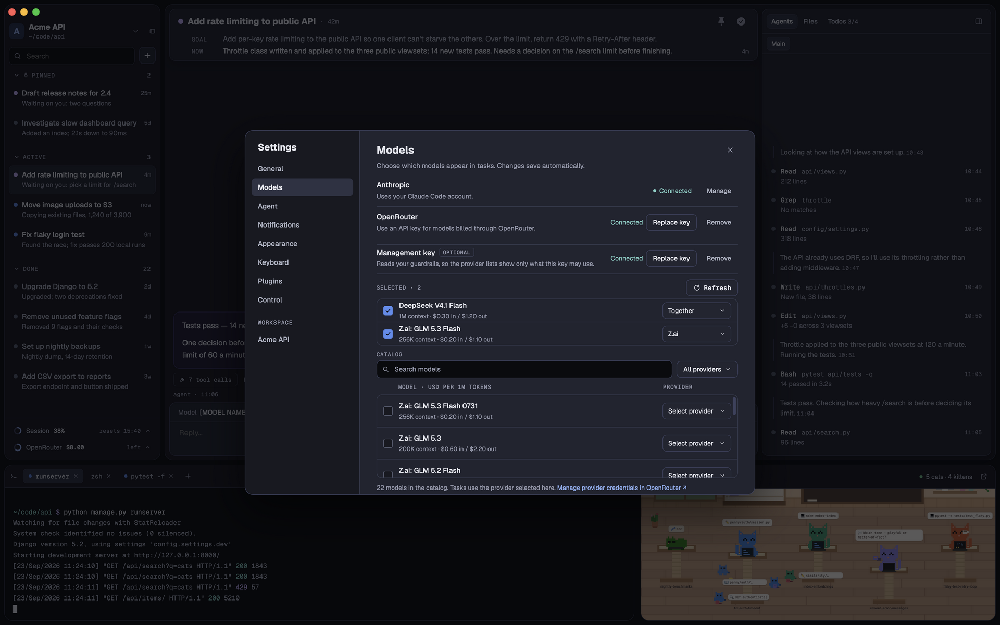
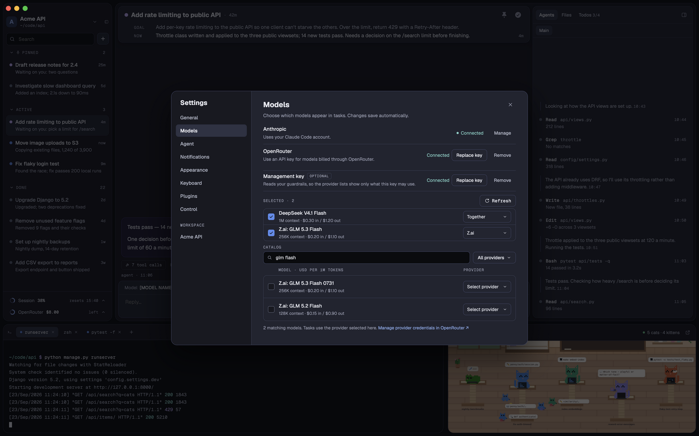
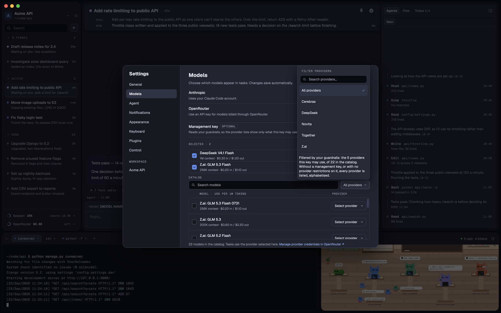
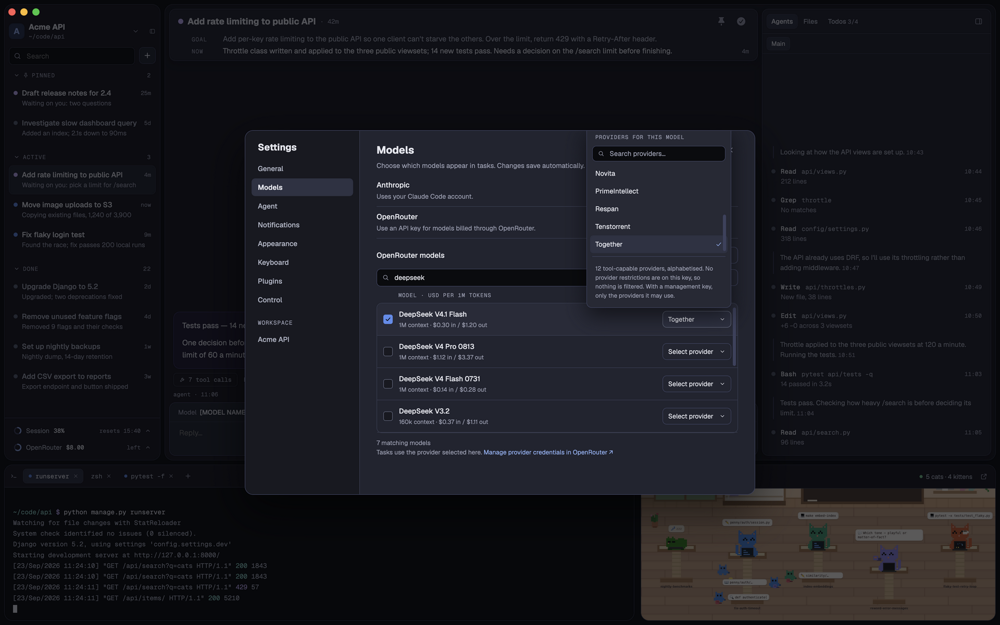
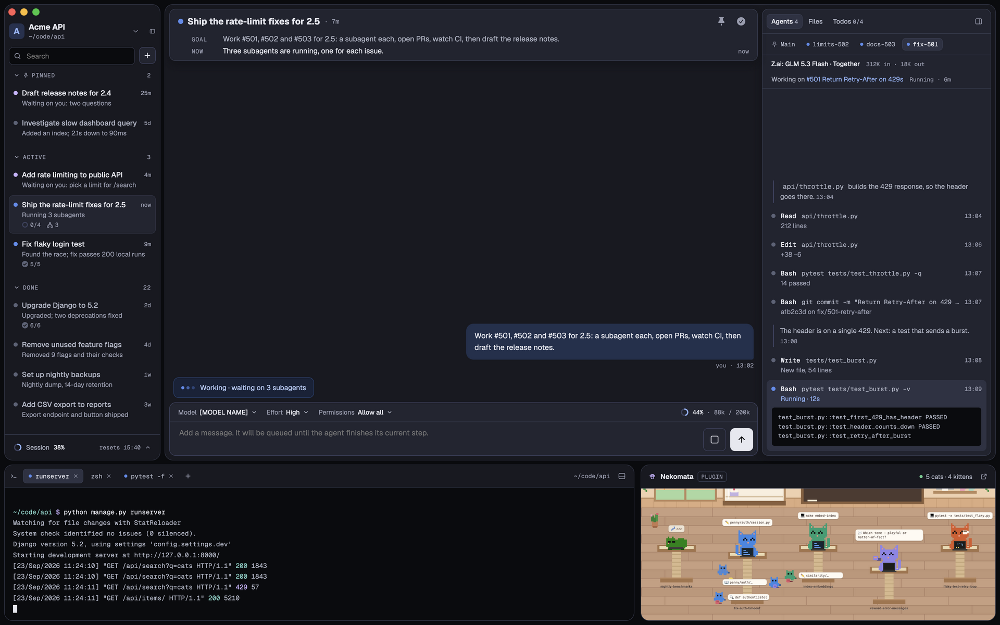

# OpenRouter UI mockups

Proposed screens for a small extension to Glade's existing model selection. The application is not implemented by
these mockups. The HTML reuses the current Settings and New task mockups, their 980×700 Settings modal, local Geist
fonts, design tokens and menu shapes. Rendered screens are 1920×1200 at 1×.

## Flow

1. Open **Settings → Models**, a single new section in the existing modal. The Anthropic account remains connected.
2. Add the OpenRouter inference key. Glade validates it and fetches the filtered model catalog.
3. Search/filter the detected models. Pick a provider from that model's detected endpoints, then check the model to
   include it in the task picker. A model cannot be enabled without an explicit provider choice.
4. The task picker contains the normal Claude choices plus only enabled OpenRouter models. Source headings identify
   the account used; the provider appears in the saved model label.
5. There is no subagent picker. The parent chooses a model at each dispatch, including an enabled OpenRouter route
   for a Claude-account parent. Provider choices stay in Settings. Glade's dispatch tool starts a separate SDK
   session on the chosen connection; both cross-source directions have passed bounded production-adapter probes.
   Same-source children use native `Agent`; Glade dispatch is for the other source only. Native OpenRouter
   children use the parent's route; another OpenRouter child route is deferred.
   See [Mixed-source subagent dispatch](../openrouter-integration-spec.md#mixed-source-subagent-dispatch).
6. In an existing Claude task, including one paused by an Anthropic limit, use the same picker to select an enabled
   OpenRouter model and continue in the same task. A production runtime round trip through Claude, OpenRouter and
   Claude again retained the session ID, recalled a fresh tool result and kept Claude thinking in stored history.
   Provider-specific reasoning formats remain a compatibility check.
   See the [probe results](../openrouter-integration-spec.md#validation-evidence).

Provider choices are made by the user in Settings. The agent cannot supply or override a provider; the request adapter
enforces the selected provider for parent, child and helper requests. No provider fallback controls or reusable
routing-profile editor in the first version. Changing a provider creates a different curated model/provider pair;
existing tasks keep their saved pair until another is selected. A task can change source at a safe turn boundary
after background work stops. A limit-paused task can switch immediately, ending its old background work with a
logged reason. The task and its history remain; the SDK session is restarted for the selected
source. A failed history handoff preserves the prior selection and reports the problem. The picker shows
**Switching…** during preparation. A task paused by a Claude limit resumes immediately on OpenRouter; the
banner switches several paused tasks one at a time.

When the switch takes effect, the **Agents › Main** log appends a quiet timestamped line, for example
**Switched model to DeepSeek V4.1 Flash · Together (OpenRouter)**. Earlier history stays in place with its original
content and order. The line persists across relaunches, appears once per effective switch, and is not added when a
switch fails.

## Screens

### 56 · Connect OpenRouter

The existing Claude account is ready; add an OpenRouter key without another login flow.


[HTML](html/56-settings-models-connect.html)

### 56 · Curate the model picker

API-discovered catalog, model search and provider filter; one checkbox per model. DeepSeek V4.1 Flash is enabled on
Together. Other rows remain unchecked until the user chooses their provider. Catalog prices are indicative and
displayed per million tokens; the selected model's row uses the selected endpoint's prices. The screenshot shows a
short catalog excerpt, not the whole list.


[HTML](html/56-settings-models.html)

### 57 · Select a detected provider

The dropdown is populated from this model's endpoint catalog. Its options are catalog entries, not a claim that
provider credentials are configured on this inference key. OpenRouter applies account restrictions when routing.


[HTML](html/57-model-provider.html)

### 58 · Narrow task model picker

Three Claude models and the single enabled OpenRouter model, grouped by source. The full
OpenRouter catalog stays in Settings › Models. A task's model choice also determines its source. This picker also applies to
existing tasks; selecting another source requests the safe history handoff described above.


[HTML](html/58-task-model-picker.html)

### 59 · OpenRouter task selected

The existing input bar shows the selected model and the model/provider pair’s label. The parent chooses a Claude or
OpenRouter model for each dispatch, independently of its own source; the Agents panel shows the child's selected model.
Each process uses its own route's context window, so enabling a smaller child model doesn't shrink the parent.
Effort is hidden when the route advertises no effort capability. The picker uses the implemented source headings
and shows the provider as part of each saved model label. The panel uses Agents · Files · Todos.


[HTML](html/59-task-openrouter.html)

### 60 · Selected models, scrollable catalog, management key

The checked models move into their own **Selected** section above the catalog, in the same table language, so they
stay at the top as the catalog grows. The catalog itself scrolls in a fixed-height list with a visible scrollbar
instead of pushing the footer out of the modal. Under the OpenRouter key sits an optional **management key**, stored
beside it and encrypted the same way; connected, it reads the account's guardrails so both provider lists filter to
the providers this key may use (screens 62 and 63).



[HTML](html/60-settings-models-selected.html)

### 61 · Tokenised search

Search is no longer strict substring. The query is split into tokens and every token must appear in the model's id,
name or description; **glm flash** matches both GLM flash models here. The count under the table tracks the matches.



[HTML](html/61-settings-models-search.html)

### 62 · Provider filter, restricted by guardrails

With a management key connected and provider restrictions on it, the filter lists only the allowed providers,
alphabetised, with **All providers** on top. The footnote carries the degraded variant: without a management key, or
with no provider restrictions on it, every provider in the catalog is listed, alphabetised.



[HTML](html/62-settings-models-providers.html)

### 63 · Per-model provider menu, unrestricted

The per-model menu lists this model's tool-capable providers alphabetised. This screen shows the degraded state — no
provider restrictions are on the key, so nothing is filtered; its footnote carries the restricted variant, where the
menu shows only the providers the management key's guardrails allow.



[HTML](html/63-model-provider-full.html)

### 64 · The Main agent's line

Main's tab now gets the same line under the strip that a subagent's has: the model and provider it runs on with its
input and output token totals, then the task's current status and state. Totals come from the usage each assistant
message already carries; no USD is shown.


[HTML](html/64-agents-main-line.html)

### 65 · Subagent token totals

A subagent's line gains the same model·provider label and token totals beside its **Working on** line, so every
agent's spend is visible at a glance.



[HTML](html/65-agents-subagent-tokens.html)

## API discovery boundary

Discovery is API-driven: `/models/user` supplies the key-visible catalog, `/providers` supplies hosting names,
and model-specific `/endpoints` supplies provider capabilities/context/prices. `/key` supplies the usage monitor.
Normal inference keys cannot list configured BYOK credentials or account-wide credit balances; those endpoints
require management access. The mockups use illustrative data, not real-account discovery counts. A catalog entry
is not evidence that the complete SDK workflow or chosen route has passed a connection test.

Provider filtering uses an optional management key stored beside the inference key, encrypted the same way. It reads
the account's guardrails: `GET /api/v1/guardrails` requires the management key and returns guardrail objects whose
`allowed_providers` and `ignored_providers` name the providers the account may use. The inference key itself cannot
read restrictions — `/key` carries no allowed-provider field, confirmed against the live API. An account with no
guardrails, or no management key, degrades both lists to the full alphabetised catalog. The probe account had no
guardrails, so screen 62's restricted counts and provider names are invented; 63 shows the degraded state.
The UI must distinguish **catalog provider options** from **configured provider credentials**.
[Filtered models](https://openrouter.ai/docs/client-sdks/typescript/api-reference/models/models),
[model endpoints](https://openrouter.ai/docs/api/api-reference/endpoints/list-all-endpoints-for-a-model),
[guardrails](https://openrouter.ai/docs/api/api-reference/guardrails/list-guardrails),
[BYOK credential listing](https://openrouter.ai/docs/api/api-reference/byok/list-byok-keys)

## Implementation scope

Use the existing SDK backend, parser, task runner, Settings modal and picker components. Add a small catalog client,
encrypted key storage, model/provider enablement settings, source fields and the request adapter already probed.
Extend existing SQLite/IPC schemas; keep the Claude catalog separate from discovered OpenRouter models. Avoid a new
agent harness, general backend rewrite, arbitrary connection profiles, BYOK credential management and an account-wide billing
dashboard. Account/error isolation and safe session routing are part of the integration.

The earlier integration spec's separate connection/catalog controls are consolidated into this Models page. The
remaining Agent section keeps defaults, effort, permissions and sandbox settings. Its default model picker uses the
same curated list as tasks.

Render these screens with the existing hidden-window pipeline:

```sh
npm run render-design -- 56-settings-models-connect 56-settings-models 57-model-provider 58-task-model-picker \
  59-task-openrouter 60-settings-models-selected 61-settings-models-search 62-settings-models-providers \
  63-model-provider-full 64-agents-main-line 65-agents-subagent-tokens
```

Check the same names with `npm run check-design -- …`. HTML/PNG are design artifacts only; they do not connect an app
window or change any account/settings.
