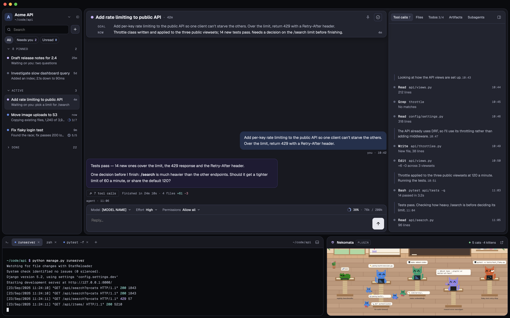
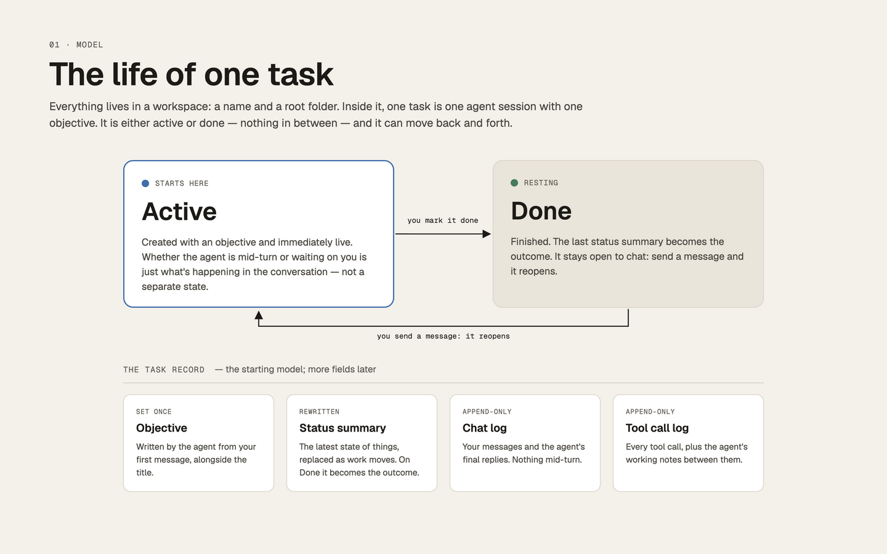
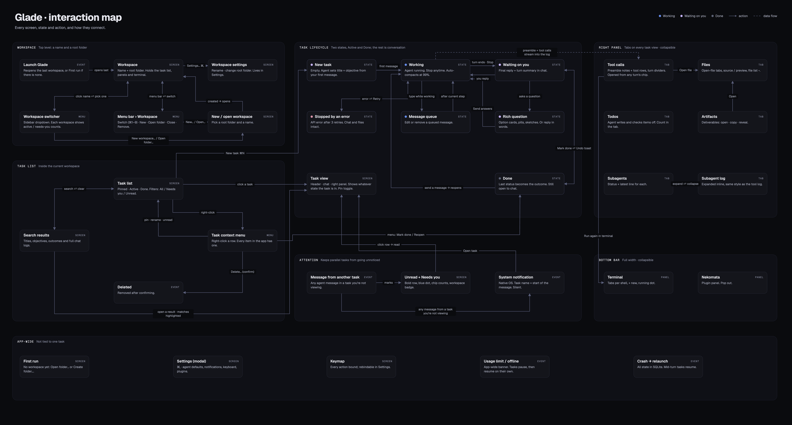

# Glade — product overview

## Concepts

**Workspace.** The top level: a name and a root folder. Every task's agent runs in the workspace root, so the root's
`CLAUDE.md` (your conventions and personal context) applies to every task. Task records live only in the app's SQLite
database. How tasks organise files on disk (a folder per task, worktrees inside it) is a convention written in that
`CLAUDE.md`, not something Glade enforces; Glade seeds a starter `CLAUDE.md` for a new workspace that has none. You can
have several workspaces and switch between them from the sidebar or the menu bar (⌘1–9). Close workspace (⌘⇧W) shows
the most recently opened other workspace, or the welcome screen when there's none; the workspace stays in the list.
Remove from list… asks first, then forgets the workspace and deletes its tasks from Glade; its folder is never touched.

**Task.** One agent session with one objective. A task has exactly two states:

- **Active** — created the moment you send the first message. Whether the agent is mid-turn, waiting on you, asking a
  question or stopped by an error is shown in the conversation and by the status dot; it is not a separate state.
- **Done** — you mark it done (no dialog; an Undo toast appears). The latest status becomes its **outcome**. A done task
  stays open to chat: sending a message reopens it.

There are no follow-up tasks. One task can refer to another through its folder on disk.

**The task record.**

| Field | How it changes |
|---|---|
| Title | Set by the agent from your first message (`set_title`). You can rename it. |
| Objective | Set once by the agent from your first message (`set_objective`). |
| Status summary | Rewritten by the agent as work moves (`set_status`). Becomes the outcome when done. |
| Chat log | Append-only. Your messages and the agent's **final reply per turn** only. |
| Tool log | Append-only. Every tool call, plus the agent's working notes ("preamble") between them. |

## The window

- **Left sidebar** — workspace switcher, search, New task (+), filter chips (All · Needs you · Unread), and the task
  list in three collapsible sections: Pinned, Active, Done. Each row shows a state dot, title, a one-line status and a
  relative time; while the agent keeps a todo list, the status ends with its progress (a ring and `3/7`, a check once
  all are done, the item in progress as its tooltip). Unread rows are bold with a blue dot. Resizable, collapsible.
- **Task card** (centre) — a header card (state dot, title, age, pin toggle, Mark done, goal and status) floating above
  the chat, and the input bar at the bottom. The input bar has model, effort and permissions pickers and a context
  meter at the right. Each task keeps its unsent draft, text and pasted images, while you're on another task and
  across a relaunch or a crash, until it's sent.
- **Right panel** (inside the task card) — tabs: Tool calls, Files, Todos, Artifacts, Subagents. Resizable, collapsible.
  Too narrow for its tabs, the tab row scrolls sideways, with chevrons at the ends that have more tabs past them.
- **Bottom bar** (full width) — a global terminal with tabs, and a plugin panel (Nekomata). Resizable, collapsible.

Each resizable panel has a drag handle in the gap on its inner edge. Dragging it takes room from the chat or gives it
back, within limits (the chat keeps its minimum width and height); collapsing a panel and showing it again brings it
back at the size you left it, and a relaunch keeps every size. The plugin panel beside the terminal has one too, in
the gap between them: it takes room from the terminal, which keeps its minimum width.

State dot colours: blue = working, purple = waiting on you, slate = done, pink = error.

## Attention

A task you aren't looking at can still need you. When its agent sends a **final reply**, **asks a question** (`ask`)
or waits on a **permission card**, in a task you're not viewing, Glade marks the task unread, counts it under "Needs
you" while it waits on you, and sends a **native macOS notification** — even while Glade is focused. Working notes and
tool calls never notify. The notification shows the task name and the start of the reply (the first question, or the
tool and what it acts on), with **Open task** and an inline **Reply** that sends your answer to the task without
opening Glade. Settings › Notifications turns them off, or their sound on (off by default); Focus and Do Not Disturb
are left to the OS.

## Settings

Settings (⌘,) opens on Agent. Changes save as you make them.

- **General:** nothing to set yet.
- **Agent:** the defaults for new tasks (model, effort and permissions: Ask first or Allow all; **Allow edits** is shown
  but disabled, as it isn't a mode yet), and two switches for what the agent keeps current: **Status summary**
  (`set_status` every turn) and **Task titles** (`set_title` from your first message). A session started with one off
  gets neither the tool nor the system prompt's ask for it.
- **Notifications:** notifications on or off, and their sound.
- **Appearance:** nothing to set yet; Glade has one theme, dark.
- **Keyboard:** every shortcut, rebindable (`keymap.md`).
- **Plugins:** the plugins installed, each turned on or off, and their folder (`plugin-api.md`).
- **Control:** whether other agents and scripts may drive Glade, and how to connect them (`control-api.md`).
- **Workspace** (under its own heading, by the workspace's name): its name and root folder.

## Everything else

Every interaction is on the interaction map:

Screens for each workflow are indexed in `design/README.md`.
