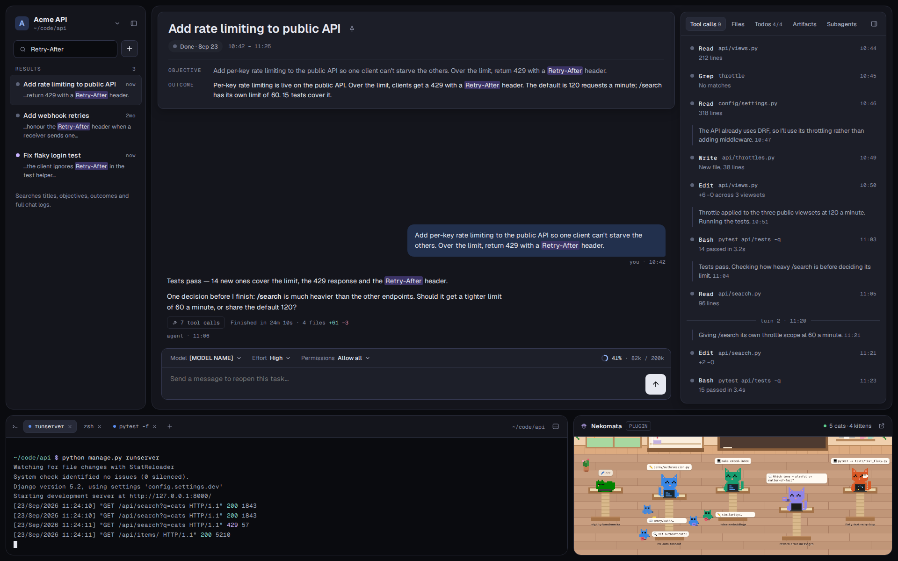

# P6-01: Search

Find anything in past and current tasks.

## Scope

- SQLite FTS over titles, objectives, statuses/outcomes and chat messages.
- Typing in the sidebar search replaces the list with results showing a snippet with the match highlighted.
- Opening a result highlights matches in the header and chat. ⌘F focuses search.

## Acceptance criteria

- [ ] Results appear as you type on a workspace with hundreds of tasks.
- [ ] Matches `07-search.png`.

## Design

## Depends on

P1-03
