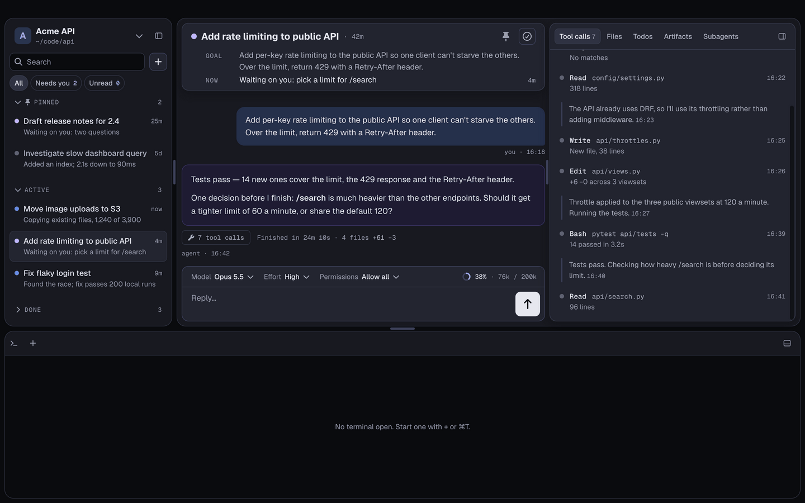
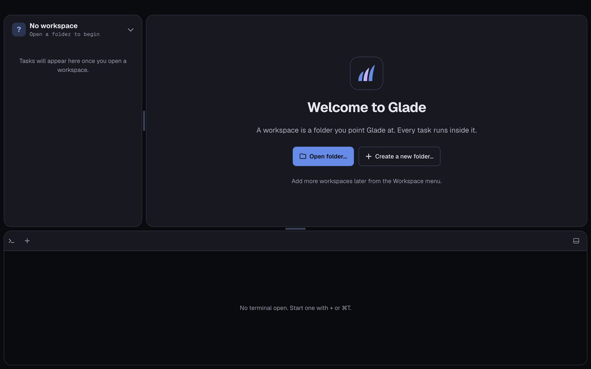
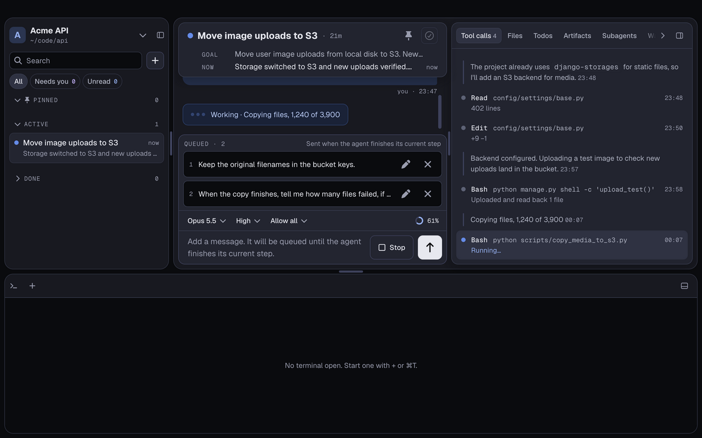
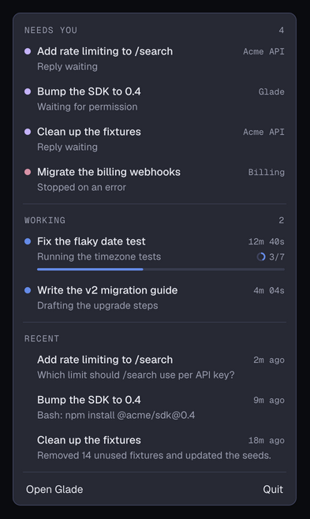
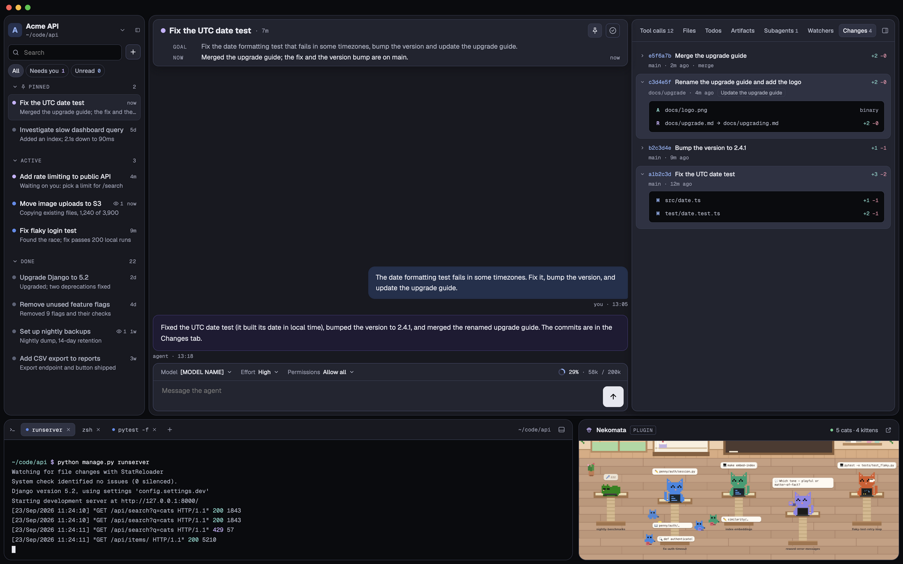
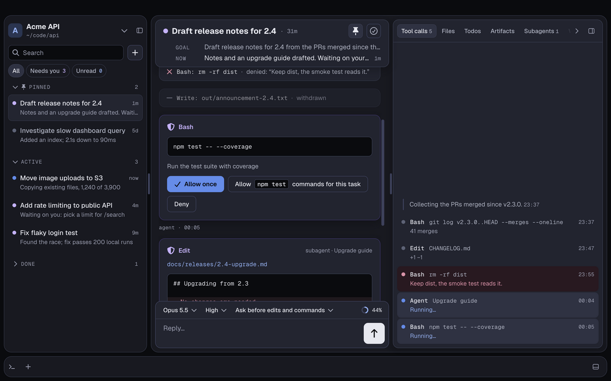
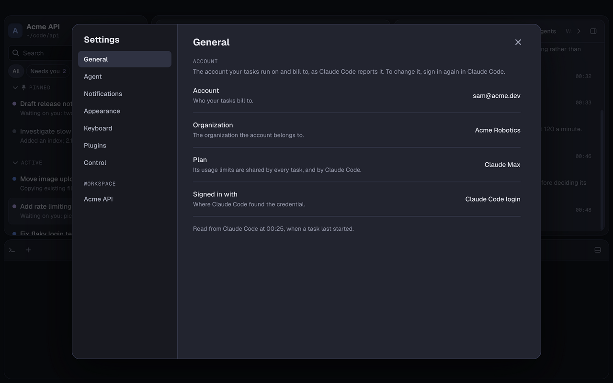
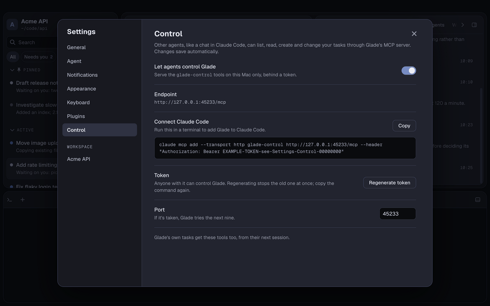
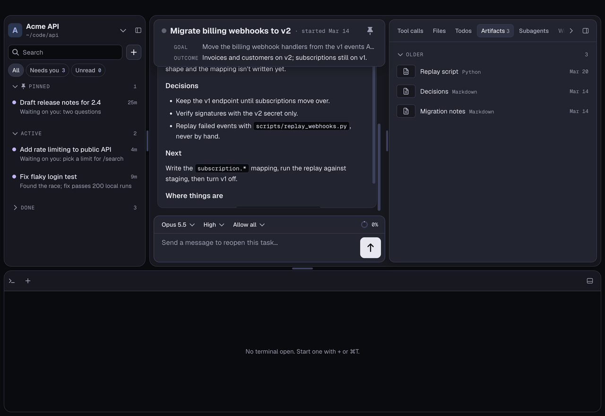

# Glade user guide

Glade runs Claude agents as **tasks**: one objective each, in a folder you choose, either Active or Done. This guide
walks through using it, from installing to letting other agents drive it. It describes Glade 0.12.

New here? The [README](../README.md) says what Glade is. The [docs index](README.md) lists every other document.



## Contents

- [Install and first launch](#install-and-first-launch)
- [The ideas](#the-ideas)
- [Workspaces](#workspaces)
- [Creating and running a task](#creating-and-running-a-task)
- [The chat](#the-chat)
- [The task header, done and reopening](#the-task-header-done-and-reopening)
- [The sidebar](#the-sidebar)
- [Knowing when a task needs you](#knowing-when-a-task-needs-you)
- [Glade in the menu bar](#glade-in-the-menu-bar)
- [The right panel](#the-right-panel)
  - [Changes](#changes)
- [The terminal](#the-terminal)
- [Permissions](#permissions)
- [Settings](#settings)
  - [Your account](#your-account)
- [Keyboard shortcuts](#keyboard-shortcuts)
- [Plugins](#plugins)
- [Let agents control Glade](#let-agents-control-glade)
  - [Connect Claude Code](#connect-claude-code)
  - [Import Claude Code sessions](#import-claude-code-sessions)
  - [Backfill past tasks from notes folders](#backfill-past-tasks-from-notes-folders)
  - [Scripting](#scripting)
- [Logs and troubleshooting](#logs-and-troubleshooting)
- [Reference](#reference)

## Install and first launch

**You need** a Mac with Apple silicon, and [Claude Code](https://docs.claude.com/en/docs/claude-code) installed and
logged in. Glade runs your agents on your own Claude Code login (or on `ANTHROPIC_API_KEY`, if you have one set). It
never asks for your credentials or stores them.

1. Download `Glade-<version>-arm64.dmg` from the
   [latest release](https://github.com/lockhart-ai/glade/releases/latest), open it and drag Glade to Applications.
2. The first time, right-click Glade in Applications and choose **Open**. Glade isn't notarised by Apple yet, so a
   double-click is refused. (See [The app won't open](#the-app-wont-open) if that doesn't work.)
3. The welcome screen asks for a folder: **Open folder…** picks one, and **Create a new folder…** lets you make one in
   the same picker. It becomes your first workspace.



Upgrading is the same: drag the new version over the old one. Your workspaces and tasks carry over.

## The ideas

- **Workspace:** a name and a root folder. Every task's agent runs in the root folder, so the root's `CLAUDE.md` (your
  conventions, your context) applies to every task. You can have several.
- **Task:** one agent session with one objective. You start it by sending a message. The agent names it, writes down
  its objective (GOAL) and keeps a one-line status (NOW) up to date as it works.
- **Active or Done:** a task is **Active** from its first message until you mark it **Done**. Its last status becomes
  its **outcome**. A done task stays open to chat: sending it a message reopens it, in the same session. Whether the
  agent is working, waiting on you or stopped by an error isn't a separate state; the status dot shows it.
- **Needs you:** an active task whose agent has finished its turn and is waiting on you, has asked you a question,
  wants your OK for a tool call, or stopped on an error. Glade counts these, marks them and notifies you.

The **status dot** on each task says what it's doing:

| Dot | Means |
|---|---|
| Blue | Working (or paused on a usage limit, and will resume by itself) |
| Purple | Waiting on you |
| Pink | Stopped by an error |
| Slate | Done |

Everything Glade knows lives in one SQLite database on your Mac, so if Glade quits or crashes mid-turn, the tasks pick
up where they left off when you open it again. Glade never writes its own files into your workspace, except a starter
`CLAUDE.md` when you add a folder that has none.

## Workspaces

The workspace's name sits at the top of the sidebar. Click it for the **workspace switcher**: every workspace with its
folder and whether it's idle, has active tasks or needs you, plus New workspace…, Open folder as workspace…,
Workspace settings… and Reveal root in Finder.

- **Add one:** New workspace… (⌘⇧N) or Open folder as workspace… (⌘O). Both open a folder picker.
- **Switch:** pick it in the switcher, or press ⌘1 – ⌘9. Glade brings back the task you had open there. Tasks in other
  workspaces keep running and notifying.
- **Rename it or move its root:** the **Workspace** menu in the menu bar (Rename workspace…, Change root folder…), or
  Workspace settings…. Changing the root moves nothing on disk.
- **Close workspace** (⌘⇧W) shows another workspace; the closed one stays in the list. **Remove from list…** asks
  first, then forgets the workspace and deletes its tasks from Glade. Its folder is never touched.

**Your `CLAUDE.md` decides how tasks keep their files.** Glade doesn't impose a layout. The starter `CLAUDE.md` it
writes for a new folder suggests one: each task keeps its files in `tasks/<task-id>-<slug>/`, with any git worktree
inside that folder. Edit it to suit you; Glade never changes a `CLAUDE.md` that exists.

## Creating and running a task

1. Press **⌘N**, or click **+** beside the search field.
2. Type what you want done and press **↵** (⇧↵ adds a line). The agent starts at once, in the workspace's root folder.
3. The agent names the task, writes its GOAL and keeps its NOW line current. Its working appears in the right panel's
   Tool calls tab; its answer arrives in the chat.

The **input bar** under the chat sets how this task runs:

- **Model:** the models your Claude Code login offers, as Claude Code names them (e.g. Default (recommended), Opus,
  Sonnet, Haiku). Glade learns the list each time an agent starts and remembers it, so it's there offline and after a
  relaunch; until the first agent has started, it offers Opus 5.5, Sonnet 5 and Haiku 4.5.
- **Effort:** how long the agent thinks before acting: Low, Medium, High, Extra high or Max, as far as the model
  supports them. Some models, like Haiku, take no effort, and the picker hides. Switch to a model that doesn't offer
  the task's effort and the effort moves to the model's default (High, where it has it), and a toast says so. A model
  with no effort keeps the task's for the next model that has one.
- **Permissions:** Allow all, or Ask before edits and commands (see [Permissions](#permissions)).
- **Context meter**, at the right: how full the task's context is. Click it to see where it compacts by itself, and
  for **Compact now** (or press ⌘⇧K). Long tasks compact automatically; the chat marks where, and the full chat and
  tool log stay in Glade.

Each task keeps its own settings; new tasks start from the defaults in Settings › Agent. Each task also keeps its
unsent draft, pasted images included, while you're on another task and across a relaunch.

You can run as many tasks at once as you like. Switching tasks never interrupts one that's working.

## The chat



The chat shows your messages and the agent's **final reply** for each turn. Everything in between (tool calls and the
agent's working notes) goes to the Tool calls tab. Under each reply, a line says how long the turn took and how many
files it changed; click **N tool calls** to see that turn's calls. The header card and the input bar stay put as you
scroll: the chat passes under them.

- **Sending while it works queues.** A message sent while the agent is working waits in a numbered queue above the input
  and goes in as soon as the agent finishes its current step. Edit a queued message with its pencil (or **↑** in an
  empty input for the last one), or remove it. There's no "send now" and no reordering.
- **Stop:** the Stop button, or **⌘.**, ends the turn. It also withdraws an open question or permission card. It
  stops only the turn: subagents and watchers the agent left running in the background carry on, and you stop each
  one from its row in the Subagents or Watchers tab.
- **Questions:** when a choice is yours, the agent asks it on a **question card** in the chat, with options to pick,
  pills or a line of text, and its turn waits however long you take. When it asks in reply to your message, the card
  opens with its answer to what you said, above the questions; that reply stays on the card once you've answered, and
  its first line is what a notification for the card says. Options and pills that don't fit on one row wrap
  onto more rows, up to three options to a row. Click through the card, or use the keyboard (the digits 1 – 9 pick an
  option, ← → move between options, ↵ sends). Or just type a reply in the input bar: it answers the questions in your
  own words.
- **Pasted images:** paste a screenshot or image (PNG, JPEG, GIF or WebP, up to 3.75 MB each) into the input bar. It
  shows as a thumbnail you can remove, and goes to the agent with your message. Images can't go with an answer to a
  question card; send them after.
- **Right-click a reply** to copy it (as text or Markdown), quote it in your reply, or show that turn's tool calls.
- **The agent can come back by itself.** If it watches a command, schedules a check-back or runs something in the
  background, it can wake up later and carry on; that turn shows in the chat like any other.

**When something goes wrong:**

- An API error that Claude Code's own retries can't get past stops the task with a card saying what happened, with
  **Retry**, **Retry with another model** and **Show details**. So does Claude Code failing to start, with the reason it
  gave, such as a missing workspace folder.
- Before you hit a **usage limit**, a quiet note takes the banner's spot across the top once Claude Code says you're
  close (70% of a window or more), e.g. "You've used 85% of your session limit · resets 14:00". Tasks keep working; the
  note goes when the window resets.
- Hitting your **usage limit**, or losing the network, pauses the affected tasks behind one banner across the top, in
  place of that note. They resume by themselves when the limit resets or the network is back; **Switch model** resumes
  them now on another model. Messages you send meanwhile wait in the queue.
- If Glade quit mid-turn, a notice at the next launch says how many tasks resumed.

## The task header, done and reopening

The header card above the chat shows the task's status dot (hover it for what it means), its title and age, and two
lines: **GOAL** (the objective) and **NOW** (the latest status, with how long ago it changed). On a done task, NOW
becomes **OUTCOME**.

- **Pin** (the thumbtack) keeps the task at the top of the sidebar, in Pinned. ⌘⇧P does the same.
- **Mark done** (the check mark, or ⌘⇧D) marks the task done with no dialog. An **Undo** toast appears for a few
  seconds. It's disabled while the agent works: stop it first.
- **Reopen** a done task by sending it a message (the input bar says "Send a message to reopen this task…"), or with
  Reopen in its right-click menu or the Task menu. It picks up in the same session.
- **Rename** with F2, or Rename… in the right-click menu; the new title is edited in place in the sidebar.

When the task list or right panel is hidden, the header has a button to show it again.

## The sidebar

- **Search** (⌘F): type and the list gives way to results from this workspace's titles, objectives, statuses, outcomes
  and full chats, each with a snippet around its best match. Opening one marks the matches and scrolls the chat to the
  first. Esc, or clearing the field, brings the list back.
- **Filter chips:** All, **Needs you** and **Unread**, each with its count.
- **Sections:** Pinned, Active and Done, each collapsible. Done loads as you scroll, however long it gets.
- **Each row** has the status dot, the title and how long ago it changed, then a one-line status. Unread rows are bold
  with a blue dot.
- **A third line** shows under the status while the task has something going on, and only then: its todo progress
  (`3/7`, or a check once all are done), how many subagents are running, and how many watchers are running, always in
  that order, each only when it isn't zero. Hover one to see what it counts ("3 subagents running"); hover the todo
  progress to see what the agent is working on. A row with none of them keeps its two lines.
- **Moving around:** ⌥↓ / ⌥↑ go to the next or previous task (from the input bar too, carrying the focus to the new
  task's input), and ⌘⌥↓ goes to the next task that needs you.
- **Right-click a task** (or ⇧F10) for Open, Pin to top, Rename…, Mark as unread, Mark done, Copy link to task and
  Delete task…. A done task offers Reopen and Copy outcome instead of Mark as unread and Mark done. The **Task** menu
  in the menu bar has the same actions for the selected task.
- **Delete task…** always asks first. It removes the task from Glade; it never touches files on disk.
- **⌘B** hides the task list; drag its edge to resize it.

## Knowing when a task needs you

A task you aren't looking at can still need you. When its agent replies, asks a question or waits on a permission card:

- the task is marked **unread** (bold, with a blue dot) and counts under **Needs you**;
- you get a **macOS notification** with the task's name and the start of the message, even while Glade is in front.
  Click it (or **Open task**) to go to the task, or use its inline **Reply** to answer without opening Glade.

Opening a task marks it read; ⌘⇧U marks it unread again. Notifications are silent by default; Settings ›
Notifications turns them off or their sound on. Focus and Do Not Disturb are up to macOS.

## Glade in the menu bar

Glade keeps an icon in the macOS menu bar, at the top right, so you can see what's in flight without switching to it.
It's Glade's mark in the menu bar's own colour, light or dark:

- while tasks need you, **how many** shows beside it;
- while any agent is working, it **pulses** gently (with Reduce motion on in macOS, it holds still).

Click it for a list, in every workspace:

- **Needs you:** each task waiting on you, its workspace, and why: asking a question, waiting for permission, stopped
  on an error, or a reply waiting.
- **Working:** each task whose agent is working, its status, its todo progress (`3/7` and a thin bar) and how long its
  turn has run.
- **Recent:** the last few notifications Glade sent, and how long ago. They're kept, so they're still there after a
  relaunch.

A section only shows while it has something in it; with nothing at all, the list says "Nothing in flight". The list
keeps up while it's open. Click a row to open Glade on that task, in its workspace. **Open Glade** brings the window
up and **Quit** quits. Esc, or clicking anywhere else, closes the list.



Settings › General › **Show Glade in the menu bar** turns the icon off, and on again (it's on to begin with).

## The right panel

Seven tabs, each with a count: **Tool calls · Files · Todos · Artifacts · Subagents · Watchers · Changes** (⌘⌥1 –
⌘⌥7). ⌘⌥B hides the panel; drag its edge to resize it.

- **Tool calls:** every tool call the task's own agent made, with the agent's working notes between them, split by turn.
  Right-click a call to copy its command or output, open its file, or **Run again in terminal** (the command lands at
  the terminal's prompt for you to edit or run; it never runs by itself).
- **Files:** the files the task changed (with a blue dot) and read. Each opens in a tab, in a read-only viewer with line
  numbers and syntax colours; Markdown has a Preview. **Open in editor** (⌘⇧E) opens the file in the app macOS uses
  for it, and ⌘W, with the focus in the panel, closes the tab. The agent can open a file here for you.
- **Todos:** the agent's own checklist, as it keeps it, with how many are done. The items come in three groups: what
  the agent is working on now, then what's done (the most recently finished first, each with when it was finished,
  like `4m ago`; hover it for the exact time), then what it hasn't started. A done item has a filled teal check and
  dimmed, struck-through text; one not started has an empty ring and full-strength text. Items move between the groups
  as the agent works. The task's row in the sidebar shows the same progress on its third line (`3/7`, or a check once
  all are done); hover it to see what the agent is working on.
- **Artifacts:** the files the agent named as its deliverables, as cards with **Open**, **Copy** and **Reveal in
  folder**. They stay after the task is done.
- **Subagents:** one row per subagent, running ones first, with how long it's run and its tool calls. A running one
  shows a one-line summary of what it's doing now under its name (refreshed about every 30 seconds; hover it for the
  whole line), then its latest tool call or the last thing it said; a finished one shows what it came to.
  Click one to open its log; right-click a running one to stop it. A subagent's own tool calls live here, not in Tool
  calls, and so does what it left running in the background: an eye with a count on its row while any of it is live,
  and its rows, each with **Stop**, under its log. That work runs on after the subagent finishes, until it ends;
  stopping the subagent ends it too ("Ended with its subagent."). The task's row in the sidebar counts the running
  subagents on its third line.
- **Watchers:** what the task's own agent left running or scheduled to wake itself later: a watch on a command's output
  (a PR's CI, a deploy's log, whatever script it wrote), a command in the background, a check-back at a set time, or a
  recurring job. A command the agent waits on isn't one, however long it runs; it's a tool call. Nor is what a subagent
  started: that's under the subagent in Subagents, and isn't counted here. Each row says what it runs, whether it's
  running, due, or ended and how, what it last reported, and how many times it woke the agent. **Stop** ends a live
  one. The count on the tab, and an eye with a count on the third line of the task's row in the task list, are the
  live ones, so a task waiting on you, or done, that still watches something shows it. A relaunch ends what was
  running (a scheduled job comes back when you next message the task).
- **Changes:** the commits the task made, newest first. See below.

### Changes



The Changes tab lists the commits the task made, newest first, and its count is how many. Glade only watches git here:
the agent commits, branches and makes worktrees as it likes, and the tab shows what it did. There's nothing to commit,
push or revert from it, and it never looks anything up on GitHub.

Each row shows the commit's short hash, the first line of its message, the lines it added and removed (`+12 −3`, a
merge's against the branch it merged into), the branch it was made on, and when. A commit a subagent made (say one
working in its own worktree) carries the subagent's name. Click a row to open the files the commit changed: each with
its status (**A**dded, **M**odified, **D**eleted, **R**enamed, from and to), and its lines, or `binary`. A huge commit
lists its first 100 files, then how many more there are.

Click a file to open it in Files. It opens as it is now when it's still at that path in the workspace. When it isn't
(deleted since, or made in a worktree that's gone, or outside the workspace), it opens as the commit left it:
read-only, labelled **As of** and the hash, with no Open in editor. A file the commit deleted shows as it was before.

What counts as the task's commits: every commit its `Bash` calls made, its subagents' included, however they made it
(`git commit`, an amend, which replaces the commit it amends, a merge commit, a cherry-pick, a script that commits).
Glade notes where each repository's `HEAD` is before a call runs and looks again once it's done, so a commit you make
at the terminal meanwhile can be counted too; a checkout, a reset or a fast-forward counts for nothing, nor does a
rebase. When two tasks commit in one repository at once, the one whose call printed the commit gets it. A commit made
by a command left running in the background isn't seen.

The list is kept with the task, so it's still there after a relaunch, and a commit's files can still be read after its
worktree is removed (git keeps them). In a workspace that isn't a git repository, the tab says so; commits the agent
makes in a repository inside the workspace still show.

## The terminal

The bottom bar holds real shells: your login shell, with your profile. It's global: its tabs stay put as you move
between tasks and workspaces.

- **⌘T** or **+** opens a tab in the current workspace's root folder. **⌃\`** focuses the terminal (opening it if it's
  hidden).
- ⌃⇥ / ⌃⇧⇥ move between tabs, ⌘K clears one, ⌃C interrupts what's running and ⌘W closes the tab.
- Each tab is named after what's running in it. Right-click it to Rename…, Duplicate, Clear, Kill process or Close.
- Quit and reopen Glade and your tabs come back with their recent output, above a new shell. Running programs don't
  survive a restart.
- **⌘J** folds the bottom bar down; drag its top edge to resize it.

## Permissions

By default a task runs with **Allow all**: the agent edits files and runs commands without asking. The input bar's
**Permissions** picker switches the task to **Ask before edits and commands**, at any time; it applies from the agent's
next tool call. Settings › Agent › Permissions sets which mode new tasks start in (**Ask first** there is this mode).



In the ask mode, file edits and writes, shell commands and other tools with side effects wait on a **permission card**
in the chat, showing the command or the change. Reads and searches, and Glade's own tools, never ask. Your own Claude
Code allow and deny rules still apply. The card offers:

- **Allow once:** this call only.
- **Allow for this task:** this tool, or for a shell command its prefix (say, `npm test` commands), for the rest of this
  task, across relaunches, and only in this task.
- **Deny**, with an optional note that the agent reads.

← and → move between the buttons, and ↵ chooses. While a card waits, the task needs you, exactly as with a question.
A card left open when Glade quits is still there after the relaunch; answering it carries the task on.

## Settings

⌘, opens Settings. Every change saves as you make it.

| Section | What's there |
|---|---|
| General | **Show Glade in the menu bar**: the icon with what needs you and what's working (see [Glade in the menu bar](#glade-in-the-menu-bar)). On to begin with. Then the **account** your tasks run on and bill to, as Claude Code reports it (below). |
| Agent | Defaults for new tasks: **Model** and **Effort**, from the same list as the input bar's pickers (Effort shows only the levels the model supports, and hides for one with none), and **Permissions** (Ask first or Allow all; Allow edits isn't available yet). **Status summary**: have the agent rewrite the task's status after every turn. **Task titles**: have the agent name the task from your first message. |
| Notifications | **Notifications** on or off, and **Sound**. |
| Appearance | Nothing yet: Glade has one theme, dark. |
| Keyboard | Every shortcut, and a way to change it (below). |
| Plugins | The installed plugins, a switch for each, and **Open plugins folder** (see [Plugins](#plugins)). |
| Control | **Let agents control Glade** (see [below](#let-agents-control-glade)). |
| *(your workspace)* | Its **Name** and **Root folder**. |

### Your account

Glade runs on Claude Code's own login and never asks for one. Settings › General shows what Claude Code says it's
using, read each time a task starts: the **account** (your email, or "API key"), its **organization**, the **plan**
whose usage limits every task shares (or "Pay as you go" for an API key), and what it's **signed in with** (Claude
Code's login, the `ANTHROPIC_API_KEY` variable, an `apiKeyHelper` script, …). If it says **Not signed in**, run
`claude` in a terminal and sign in with `/login`, then start a task. To use another account, sign in again in Claude
Code; the next task that starts picks it up.



## Keyboard shortcuts

The ones to learn first:

| Keys | Does |
|---|---|
| ⌘N | New task |
| ↵ / ⇧↵ | Send (queues while the agent works) / new line |
| ⌘. | Stop the agent |
| ⌘⇧D | Mark done |
| ⌘F | Search tasks |
| ⌥↓ / ⌥↑ | Next / previous task |
| ⌘⌥↓ | Next task that needs you |
| ⌘L | Focus the input bar |
| ⌘B · ⌘⌥B · ⌘J | Toggle the task list · right panel · bottom bar |
| ⌘⌥1 – ⌘⌥7 | Tool calls · Files · Todos · Artifacts · Subagents · Watchers · Changes |
| ⌘T · ⌃\` | New terminal tab · focus the terminal |
| ⌘1 – ⌘9 | Switch workspace |
| ⌘, | Settings |

Every shortcut is listed in Settings › Keyboard. To change one, click it and press the new keys; **Reset** puts its
default back. Keys another shortcut or macOS already uses are refused, with the reason. The full list, and the rules for
rebinding, are in [the keymap](keymap.md). What you can right-click, and what each menu offers, is in
[context menus](context-menus.md).

## Plugins

A plugin is a small web page that sits in the bottom bar beside the terminal and watches your tasks. Each runs in its
own sandbox: no access to your files, no network beyond your own Mac, and it sees only task and agent events (titles,
states, one-line tool-call summaries, subagents, questions and permission requests), never your chat, tool output or
files.

**Installing** one is copying its folder into Glade's plugins folder: Settings › Plugins › **Open plugins folder**
(`~/Library/Application Support/glade/plugins/`). Glade looks for plugins at launch and each time you open Settings ›
Plugins, which lists them with a switch each; a broken one is listed with the reason. Delete the folder to remove it.
Drag the handle between the terminal and the plugin to resize it.

**Nekomata**, the cat cafe, is the first plugin: each active task is a cat, each subagent a kitten, and a cat raises its
paw when its task needs you. To install it:

```sh
git clone https://github.com/lockhart-ai/nekomata.git
cd nekomata
git checkout glade-plugin   # the Glade build, until it's merged into main
./build.sh glade
cp -R dist/glade/nekomata ~/Library/Application\ Support/glade/plugins/
```

Then open Settings › Plugins: Nekomata is listed, switched on, and appears beside the terminal.

Writing your own? [The plugin API](plugin-api.md) has the manifest, the sandbox and every event.

## Let agents control Glade

Glade can be driven by other agents: a Claude Code chat, a script, or one of Glade's own tasks can list, read, create
and change tasks, import your Claude Code sessions, and backfill past work from notes. It's off until you turn it on,
and it only ever listens on your own Mac, behind a token.

**Turn it on:** Settings › Control › **Let agents control Glade**. The section then shows:

- the **Endpoint** (`http://127.0.0.1:45233/mcp` unless the port is taken);
- **Connect Claude Code**: a ready-to-paste `claude mcp add …` command, with **Copy**;
- **Regenerate token**, which stops the old token at once (copy the command again afterwards);
- the **Port**, which you can change (if it's taken, Glade tries the next nine).



Glade's own tasks get the same tools (`glade-control`) from their next session: a task started after you turn it on
has them. Just ask a task in plain words; if it doesn't find the tools, tell it to "use the glade-control tools". In the
ask permission mode, tools that change things wait on a permission card; reads never ask. A task can't stop, delete or
message itself through them, and deleting any task needs an explicit confirmation.

### Connect Claude Code

1. Copy the command from Settings › Control and run it in a terminal:

   ```sh
   claude mcp add --transport http glade-control http://127.0.0.1:45233/mcp --header "Authorization: Bearer <token>"
   ```

   Claude Code adds it for the folder you run it in; add `--scope user` to have it in every folder.
2. Start `claude` and ask, for example:
   - *"What Glade tasks need me right now?"*
   - *"Create a Glade task in the Acme API workspace to upgrade the test runner, and start it."*
   - *"Mark the Glade task 'Fix flaky login test' done."*

If you regenerate the token or change the port, run the new command again (`claude mcp remove glade-control` first).

### Import Claude Code sessions

Your Claude Code history can come into Glade as tasks: each session becomes a task with its chat, tool calls and times,
done by default, in the workspace whose root folder is the folder the session ran in. Send it a message and it resumes
that very Claude Code session, with everything the model knew.

1. Make sure each folder you worked in is a Glade workspace (Open folder as workspace…), or let the import add them.
2. Turn on **Let agents control Glade**.
3. Open a task in any workspace (or a Claude Code chat connected as above) and ask, for example:
   - *"List my Claude Code sessions that aren't in Glade yet with list_claude_code_sessions."*
   - *"Import every Claude Code session started in ~/code/api into Glade with import_claude_code_session."*
   - *"Import all my Claude Code sessions that aren't in Glade yet. If a session's folder isn't a workspace, create one
     for it (createWorkspace: true). Page through the whole list."*
   - For hundreds of sessions: *"Write a script that pages through list_claude_code_sessions with imported: false and
     imports each one over `$GLADE_CONTROL_URL/v1/tools`, then run it."* (See [Scripting](#scripting).)

Good to know:

- Importing is safe to repeat: a session already in Glade returns the task it's in.
- A session is imported only into the workspace whose root is exactly its folder. Sessions started in a subfolder of a
  workspace aren't moved into it.
- Thinking, subagents' own transcripts, slash commands and images are left out.
- Don't carry on the same session in Claude Code and in Glade at once: both would write to the same transcript.

### Backfill past tasks from notes folders

If you kept past work outside Glade, say a folder of notes per task, you can bring each one in as a done task with a
**handoff note**: what it was, where it got to, the decisions made, what's next and where its files are. The note shows
on a **Backfilled** card at the top of the task's chat, and the agent always has it: open the task, send *"Let's pick
this up."*, and it knows where it was.



1. Put the notes folders inside the workspace they belong to (say `~/code/api/notes/<task>/`). A task's artifacts must
   be files inside its workspace; notes kept elsewhere can still be named in the handoff note, and the agent can read
   them.
2. Turn on **Let agents control Glade**.
3. Open a new task in that workspace, so it has the tools and the environment, and ask. For a few folders:

   > *"For each folder in notes/, read its files and create a done Glade task for it with create_task: a title, an
   > objective, a handoff note in Markdown (what it was, where it got to, decisions, next steps, where its files are),
   > its notes files as artifacts (absolute paths), its start date as startedAt from the earliest date in the notes,
   > state: done, and the folder's path as externalId."*

   For many folders, have it write a script instead:

   > *"Write a Node script that goes through each folder in ~/code/api/notes, reads its notes, and creates a Glade task
   > for it through `$GLADE_CONTROL_URL/v1/tools/create_task` with a title, objective, status, a handoff note, its files
   > as artifacts, its original start date, `state: done`, and the folder path as `externalId`. Back off on 429. Try it
   > on two folders first, then run it on all of them."*

4. Open one of the new tasks in the Done section, read its Backfilled card, and send it a message to pick it up.

Good to know:

- **Rerunning is safe.** The `externalId` makes each call idempotent: a folder already backfilled returns its task and
  changes nothing, so an interrupted backfill can simply be run again.
- A backfilled task never starts its agent by itself; it waits for your message.
- The handoff note is Markdown, at most 32 KB. The agent can replace or clear it later with `update_task`; the window
  never edits it.
- A start date in the future, or an artifact that isn't a file inside the workspace, is refused, naming the problem,
  and nothing is created.

### Scripting

For anything that would take hundreds of tool calls, a script is quicker. The same tools are served as plain JSON:
`GET /v1/tools` lists them and `POST /v1/tools/<name>` calls one, with the tool's input as the body, behind the same
token.

- **In Glade's own tasks** the environment already has what a script needs, while control is on: `GLADE_CONTROL_URL`
  (for example `http://127.0.0.1:45233`) and `GLADE_CONTROL_TOKEN`. A task gets them when its agent session starts and
  keeps them while it runs, so after turning control on, regenerating the token or changing the port, use a new task,
  or relaunch Glade.
- **Anywhere else**, set them yourself: the URL is the endpoint without `/mcp`, and the token is the part after
  `Bearer` in Settings › Control's command.

```sh
curl -s "$GLADE_CONTROL_URL/v1/tools/list_tasks" \
  -H "Authorization: Bearer $GLADE_CONTROL_TOKEN" -H 'Content-Type: application/json' \
  -d '{"state": "active", "limit": 10}'
```

A refused call answers with an HTTP status and `{ "error": { "code", "message" } }`. Calls are rate limited (1,200
changes and 3,000 reads a minute); a `429` says how long to wait in `retryAfterMs`. [The control API](control-api.md)
has every tool, its input and output, and a complete Node backfill script.

## Logs and troubleshooting

### The app won't open

Glade isn't notarised by Apple yet. Right-click it in Applications and choose **Open**. On newer macOS, if there's no
Open button, try to open it once, then click **Open Anyway** in System Settings › Privacy & Security. If macOS still
refuses, run this and try again:

```sh
xattr -dr com.apple.quarantine /Applications/Glade.app
```

### The agent can't find my tools

Opened from Finder or the Dock, an app gets macOS's bare `PATH`, without Homebrew, nvm, pnpm or `~/.local/bin`. So at
launch Glade asks your login shell (`$SHELL -ilc`) for its environment, and gives your agents that. If your profile
takes longer than 10 seconds or fails, Glade carries on with its own environment and logs why (the `env` scope in the
log). Fix the profile, then quit and reopen Glade: it reads the environment once, at launch. The terminal's tabs always
run your login shell.

### The first message fails

When Claude Code can't start at all, the error card says why when Claude Code does: the workspace folder is missing,
there's no shell to run commands with, your organization's settings or gateway refused it, and so on. **Show details**
shows what it printed. Fix that (for a missing folder, put it back or open the right one as a workspace), then
**Retry**.

Otherwise, check that Claude Code works on its own: run `claude` in a terminal and make sure you're logged in. Settings ›
General shows the account the last task started on, or **Not signed in**. Then look in the log for the `agent` and
`runner` lines of that task. What the Claude Code process printed to its error output is there too, as `agent stderr`
lines:

```sh
grep '"msg":"agent stderr' ~/Library/Logs/glade/main.log
```

### Where your data lives

| What | Where |
|---|---|
| Workspaces, tasks, chats, tool logs, queues, drafts, settings, terminal scrollback | `~/Library/Application Support/glade/glade.db` (SQLite) |
| Plugins | `~/Library/Application Support/glade/plugins/` |
| Logs | `~/Library/Logs/glade/main.log` |
| The agents' own session transcripts | Where Claude Code keeps them, `~/.claude/projects/` |

Everything stays on your Mac. Deleting a task or removing a workspace deletes rows in the database, never files in your
folders.

### Logs

Glade logs what it does, one JSON line per event, to `~/Library/Logs/glade/main.log` (rotated at 5 MB, five old files
kept). Secrets are redacted and message text is cut short. Read it with Console.app or:

```sh
tail -f ~/Library/Logs/glade/main.log
grep -E '"level":"(warn|error)"' ~/Library/Logs/glade/main.log
```

Attach it to a bug report if you like. [Logs](logs.md) explains every field and scope.

## Reference

- [The README](../README.md) and [the docs index](README.md).
- [Product overview](product.md): the concepts, in more detail.
- [Keymap](keymap.md) and [context menus](context-menus.md).
- [Control API](control-api.md): every `glade-control` tool, the HTTP endpoint and scripting.
- [Plugin API](plugin-api.md): writing a plugin.
- [Logs](logs.md): what the log holds and how to read it.
- [Release notes](releases/v0.12.0.md) for each version, in `releases/`.
